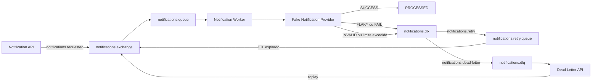

# 🐇 RabbitRescue


Projeto demonstrativo de **mensageria confiável** com Java, Spring Boot e RabbitMQ.

O RabbitRescue simula um serviço assíncrono de notificações que precisa lidar com falhas transitórias, mensagens inválidas, tentativas limitadas, Dead Letter Queue e replay manual. A proposta é mostrar o comportamento real do broker, sem esconder retry e roteamento atrás de abstrações maiores.

## O problema

Em integrações assíncronas, nem toda falha significa a mesma coisa:

- uma indisponibilidade temporária pode ser resolvida em uma nova tentativa;
- uma mensagem inválida continuará falhando, independentemente do número de retries;
- retries infinitos consomem recursos e escondem problemas;
- mensagens irrecuperáveis precisam ser isoladas para análise e possível reprocessamento.

Este projeto implementa esses caminhos usando **Spring AMQP**, **RabbitMQ DLX** e **TTL**.

## Conceitos demonstrados

- publicação assíncrona de eventos;
- consumo com `@RabbitListener`;
- retry atrasado pelo broker;
- limite explícito de tentativas;
- diferenciação entre falhas transitórias e permanentes;
- isolamento de poison messages em uma DLQ;
- preservação de `messageId` e `correlationId`;
- replay administrativo de mensagens;
- testes de integração com RabbitMQ real via Testcontainers;
- testes de carga e confiabilidade com k6;
- health check e métricas com Spring Boot Actuator.

## Arquitetura



### Fluxo de retry

1. A API publica a mensagem em `notifications.exchange`.
2. A mensagem é roteada para `notifications.queue`.
3. O worker processa a mensagem.
4. Uma falha transitória é republicada em `notifications.dlx` com a routing key de retry.
5. A mensagem permanece em `notifications.retry.queue` durante o TTL configurado.
6. Quando o TTL expira, o RabbitMQ envia a mensagem novamente ao exchange principal.
7. Ao atingir o limite de tentativas, a mensagem é enviada para `notifications.dlq`.

O atraso não usa `Thread.sleep` e não mantém uma thread do consumidor bloqueada. O RabbitMQ controla o tempo de espera e o retorno da mensagem ao fluxo principal.

## Topologia RabbitMQ

| Recurso | Tipo | Responsabilidade |
|---|---|---|
| `notifications.exchange` | Direct exchange | Recebe mensagens novas, replay e mensagens devolvidas após o TTL |
| `notifications.dlx` | Direct exchange | Roteia mensagens para retry ou DLQ |
| `notifications.queue` | Durable queue | Fila principal consumida pelo worker |
| `notifications.retry.queue` | Durable queue | Mantém a mensagem durante o atraso de retry |
| `notifications.dlq` | Durable queue | Armazena mensagens que não podem continuar no fluxo normal |

### Routing keys

| Routing key | Destino |
|---|---|
| `notifications.requested` | `notifications.queue` |
| `notifications.retry` | `notifications.retry.queue` |
| `notifications.dead-letter` | `notifications.dlq` |

### Metadados AMQP

| Campo | Finalidade |
|---|---|
| `messageId` | Identificador estável da mensagem |
| `correlationId` | Correlação entre API, retries, logs, DLQ e replay |
| `x-attempt` | Número da tentativa atual |
| `x-error-type` | Tipo da última exceção |
| `x-error-message` | Mensagem segura do último erro |
| `x-replayed` | Indica que a mensagem foi reenfileirada manualmente |

## Modos do provider

O provider simulado permite reproduzir quatro comportamentos:

| Modo | Comportamento | Resultado esperado |
|---|---|---|
| `SUCCESS` | Processa sem erro | `PROCESSED` na tentativa 1 |
| `FLAKY` | Falha somente na primeira tentativa | `PROCESSED` na tentativa 2 |
| `FAIL` | Falha transitoriamente em todas as tentativas | DLQ após a tentativa 3 |
| `INVALID` | Lança uma falha permanente | DLQ na tentativa 1 |

O modo pode ser informado no payload da notificação ou definido globalmente pela API do provider. Quando `processingMode` não é enviado, o evento utiliza o modo global atual.

## Stack

- Java 21;
- Spring Boot 3.5.16;
- Spring Web;
- Spring AMQP;
- RabbitMQ 4 Management;
- Bean Validation;
- Spring Boot Actuator;
- Docker Compose;
- Gradle;
- JUnit 5;
- Awaitility;
- Testcontainers;
- k6.

## Pré-requisitos

- JDK 21;
- Docker Engine ou Docker Desktop em execução;
- Git.

Não é necessário instalar RabbitMQ localmente. O container é iniciado pelo Docker Compose integrado ao Spring Boot.

## Executando o projeto

Clone o repositório:

```bash
git clone https://github.com/vitorhugo-dotnet/rabbitRescue.git
cd rabbitRescue
```

Linux ou macOS:

```bash
./gradlew bootRun
```

Windows:

```powershell
.\gradlew.bat bootRun
```

Durante o desenvolvimento, o Spring Boot utiliza `docker-compose.yml` e gerencia o ciclo de vida do RabbitMQ automaticamente.

### Serviços disponíveis

| Serviço | Endereço |
|---|---|
| API | `http://localhost:8080` |
| Actuator health | `http://localhost:8080/actuator/health` |
| Actuator metrics | `http://localhost:8080/actuator/metrics` |
| RabbitMQ Management | `http://localhost:15672` |

Credenciais locais do RabbitMQ Management:

```text
username: rabbitrescue
password: rabbitrescue
```

## Endpoints

| Método | Endpoint | Descrição |
|---|---|---|
| `POST` | `/notifications` | Publica uma nova notificação |
| `GET` | `/notifications/dead-letters` | Lista mensagens da DLQ sem removê-las |
| `POST` | `/notifications/dead-letters/{messageId}/replay` | Remove uma mensagem da DLQ e a republica |
| `POST` | `/provider/mode/{mode}` | Altera o modo global do provider |

Valores aceitos em `{mode}`: `success`, `fail`, `flaky` e `invalid`.

## Reproduzindo os cenários

Os exemplos abaixo usam `curl` e definem um `X-Correlation-Id` explícito para facilitar o rastreamento.

### 1. Processamento com sucesso

```bash
curl -i -X POST http://localhost:8080/notifications \
  -H "Content-Type: application/json" \
  -H "X-Correlation-Id: demo-success" \
  -d '{
    "recipients": ["success@rabbitrescue.dev"],
    "subject": "Mensagem válida",
    "content": "Deve ser processada na primeira tentativa",
    "processingMode": "SUCCESS"
  }'
```

A API responde com HTTP `202 Accepted` e o estado inicial `PUBLISHED`. O processamento ocorre de forma assíncrona.

### 2. Falha transitória seguida de sucesso

```bash
curl -i -X POST http://localhost:8080/notifications \
  -H "Content-Type: application/json" \
  -H "X-Correlation-Id: demo-flaky" \
  -d '{
    "recipients": ["flaky@rabbitrescue.dev"],
    "subject": "Provider instável",
    "content": "Falha uma vez e processa no retry",
    "processingMode": "FLAKY"
  }'
```

A primeira tentativa falha, a mensagem aguarda o TTL de retry e volta para ser processada na tentativa 2.

### 3. Falha transitória até o limite

```bash
curl -i -X POST http://localhost:8080/notifications \
  -H "Content-Type: application/json" \
  -H "X-Correlation-Id: demo-fail" \
  -d '{
    "recipients": ["fail@rabbitrescue.dev"],
    "subject": "Provider indisponível",
    "content": "Deve esgotar as tentativas",
    "processingMode": "FAIL"
  }'
```

Com a configuração padrão, a mensagem realiza três processamentos e termina na DLQ.

### 4. Poison message

```bash
curl -i -X POST http://localhost:8080/notifications \
  -H "Content-Type: application/json" \
  -H "X-Correlation-Id: demo-invalid" \
  -d '{
    "recipients": ["invalid@rabbitrescue.dev"],
    "subject": "Mensagem inválida",
    "content": "Deve ir diretamente para a DLQ",
    "processingMode": "INVALID"
  }'
```

Como a falha é permanente, a mensagem não passa pelo ciclo de retry e segue para a DLQ na primeira tentativa.

### 5. Consultar a DLQ

```bash
curl "http://localhost:8080/notifications/dead-letters?limit=50"
```

A consulta usa `basic.get` sem auto-ack e devolve as mensagens ao broker após a leitura. O endpoint não consome definitivamente os registros listados.

O limite padrão da API é 50. A configuração atual restringe a leitura efetiva a no máximo 100 mensagens por operação.

### 6. Replay após corrigir a causa

Para demonstrar uma recuperação real, publique a mensagem **sem** `processingMode`. Assim, o replay poderá usar um novo modo global.

Defina o provider como inválido:

```bash
curl -X POST http://localhost:8080/provider/mode/invalid
```

Publique a mensagem usando o modo global:

```bash
curl -i -X POST http://localhost:8080/notifications \
  -H "Content-Type: application/json" \
  -H "X-Correlation-Id: demo-replay" \
  -d '{
    "recipients": ["replay@rabbitrescue.dev"],
    "subject": "Mensagem para replay",
    "content": "Primeiro falha, depois deve ser reprocessada"
  }'
```

Consulte a DLQ e copie o `messageId`:

```bash
curl http://localhost:8080/notifications/dead-letters
```

Simule a correção da causa raiz:

```bash
curl -X POST http://localhost:8080/provider/mode/success
```

Republique a mensagem:

```bash
curl -i -X POST \
  http://localhost:8080/notifications/dead-letters/SEU_MESSAGE_ID/replay
```

O replay:

- preserva `messageId` e `correlationId`;
- reinicia `x-attempt` em 1;
- adiciona `x-replayed: true`;
- confirma a remoção da mensagem selecionada da DLQ após a republicação local.

> Uma mensagem cujo payload contém `processingMode: "INVALID"` continuará inválida após o replay. O replay não corrige o conteúdo: ele apenas oferece uma nova oportunidade de processamento depois que a causa externa ou os dados forem corrigidos.

## Configuração

As principais propriedades ficam em `src/main/resources/application.yaml`:

```yaml
rabbit-rescue:
  messaging:
    retry-delay: 5s
    max-attempts: 3
    dead-letter-browse-limit: 100
```

### Variáveis de ambiente do RabbitMQ

| Variável | Valor padrão |
|---|---|
| `RABBITMQ_HOST` | `localhost` |
| `RABBITMQ_PORT` | `5672` |
| `RABBITMQ_USERNAME` | `rabbitrescue` |
| `RABBITMQ_PASSWORD` | `rabbitrescue` |
| `RABBITMQ_VHOST` | `/` |

Publisher confirms correlacionados, publisher returns e publicação obrigatória estão habilitados na configuração do Spring AMQP.

## Testes automatizados

Os testes exigem Docker porque o RabbitMQ é criado pelo Testcontainers.

Linux ou macOS:

```bash
./gradlew test
```

Windows:

```powershell
.\gradlew.bat test
```

O teste de integração não usa mock do broker. Ele valida:

1. publicação, consumo e processamento de uma mensagem válida;
2. retry de uma mensagem flaky preservando o `correlationId`;
3. envio direto de poison message para a DLQ;
4. envio para a DLQ após o limite de falhas transitórias;
5. replay, remoção da DLQ e processamento da mesma mensagem.

Nos testes, o TTL é reduzido para 250 ms para manter a suíte rápida sem alterar o comportamento usado pela aplicação.

## Testes com k6

Os scripts disponíveis são:

- `smoke`: valida disponibilidade e publicação básica;
- `load`: aplica carga contínua sobre o endpoint de notificações;
- `reliability`: mistura aproximadamente 80% `SUCCESS`, 15% `FLAKY` e 5% `INVALID`, verificando também a presença das poison messages na DLQ.

### Windows com Docker

```powershell
.\k6\run.ps1 -Test smoke -Docker
.\k6\run.ps1 -Test load -Docker
.\k6\run.ps1 -Test reliability -Docker
```

### Linux ou macOS com Docker

```bash
K6_DOCKER=1 bash ./k6/run.sh smoke
K6_DOCKER=1 bash ./k6/run.sh load
K6_DOCKER=1 bash ./k6/run.sh reliability
```

Exemplo de configuração da carga:

```bash
RATE=25 \
DURATION=60s \
PRE_ALLOCATED_VUS=30 \
MAX_VUS=150 \
K6_DOCKER=1 \
bash ./k6/run.sh reliability
```

## Observabilidade

O Actuator expõe:

- `/actuator/health`;
- `/actuator/info`;
- `/actuator/metrics`.

O worker adiciona `correlationId` e `attempt` ao MDC durante o processamento e registra eventos como:

- `notification_processed`;
- `notification_retry_scheduled`;
- `notification_dead_lettered`.

O projeto ainda não possui uma configuração customizada de Logback. Portanto, para imprimir os campos do MDC explicitamente no console ou gerar logs JSON estruturados, é necessário adicionar um pattern ou encoder próprio.

## Estrutura principal

```text
src/main/java/com/vitorhugo/rabbitrescue
├── config
│   ├── MessagingProperties.java
│   └── RabbitMQConfig.java
├── deadletter
│   ├── DeadLetterController.java
│   └── DeadLetterService.java
├── notification
│   ├── api
│   ├── application
│   ├── domain
│   └── messaging
└── provider
    ├── FakeNotificationProvider.java
    ├── ProviderModeController.java
    └── ProviderModeState.java

src/test/java/com/vitorhugo/rabbitrescue
├── integration
└── support

k6
├── lib
├── smoke.js
├── load.js
├── reliability.js
├── run.ps1
└── run.sh
```

## Decisões e trade-offs

### Spring AMQP com DLX e TTL

**Vantagens**

- deixa a topologia e o comportamento do RabbitMQ explícitos;
- demonstra exchanges, routing keys, DLX e TTL;
- evita bloquear threads durante o atraso;
- é adequado para estudo, portfólio e entrevistas técnicas.

**Custo**

- exige mais configuração do broker;
- o fluxo de retry precisa ser compreendido e monitorado;
- mudanças na topologia devem ser coordenadas em ambientes persistentes.

### Estado em memória

O `NotificationStatusStore` mantém o estado de processamento em memória. Isso simplifica o projeto, mas significa que:

- o histórico é perdido ao reiniciar a aplicação;
- múltiplas instâncias não compartilham o mesmo estado;
- não existe atualmente um endpoint público para consultar o estado por `messageId`.

### Consulta e replay da DLQ

AMQP 0-9-1 não oferece uma operação nativa de browse. A implementação usa `basic.get`, mantém as mensagens sem ack e as devolve ao broker ao final da operação.

Um `ReentrantLock` protege listagem e replay dentro de uma única instância. Em um deployment distribuído, seria necessário um mecanismo de coordenação compartilhado ou outra estratégia administrativa.

## Evoluções possíveis

- persistir o estado em PostgreSQL;
- implementar idempotência e deduplicação por `messageId`;
- usar Outbox Pattern na publicação inicial;
- aguardar e tratar publisher confirms explicitamente;
- proteger endpoints administrativos com autenticação e autorização;
- criar métricas específicas para retry, DLQ e replay;
- adicionar logs JSON estruturados;
- adotar filas de retry em múltiplos níveis;
- criar uma parking lot queue para mensagens que exigem intervenção manual;
- expor consulta de status por `messageId`;
- adicionar tracing distribuído.

## Objetivo do projeto

O RabbitRescue foi criado para treinar e demonstrar decisões que aparecem em sistemas assíncronos reais: distinguir falhas recuperáveis, limitar retries, preservar rastreabilidade, evitar loops infinitos e tratar mensagens que precisam de intervenção humana.

Não é apenas uma fila que tenta novamente. É um laboratório pequeno para entender como um sistema se comporta quando as coisas dão errado, que é quando a arquitetura finalmente para de parecer bonita no diagrama e começa a justificar sua existência.
